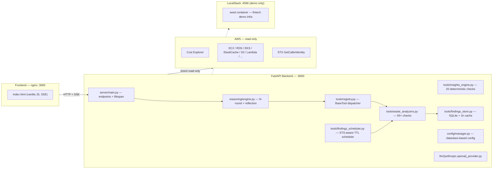

# CLAUDE.md — FinOps Intelligence Platform

> Operational manual for any AI coding agent (Claude, Cursor, Copilot) working on this repo.
> Read this **before** writing code. The conventions below are non-negotiable: they are what
> makes this project safe to point at a real AWS account.

---

## 1. What This Project Is

**Owner:** [DevOps ARG](https://www.devopsarg.com) — DevOps & SRE consultancy (Argentina, LatAm focus).

**Product:** An AI-powered FinOps platform. The user connects their AWS account (read-only),
the platform scans for waste + billing anti-patterns, and a conversational agent (Claude or GPT)
answers cost questions by orchestrating ~20 read-only tools, including a generic `call_aws`
that can hit any AWS read API on demand.

**Status:** Production-grade reference implementation, not a toy. Used as both:
1. A live demo of DevOps ARG's platform-engineering and agentic-AI capabilities.
2. A real product clients can self-host inside their VPC (their data never leaves their account).

**Key differentiators (do not regress these):**
- **Read-only by construction.** Multiple defense layers (IAM, prefix allowlist, dry-run check at boot).
- **Multi-round agentic reasoning** with reflection — not a single-shot prompt-then-answer pattern.
- **Mock/Live isolation** at the data layer (see §6) — demo data and real AWS data cannot mix.
- **Zero-cost demo path** via LocalStack — anyone can `docker compose up` and see the product.

---

## 2. Architecture



**Layering rules (enforce in code review):**
- `server/` may import from anything. Nothing imports from `server/`.
- `reasoning/` imports `llm/` + `tools/registry`. Never imports a concrete tool.
- `tools/` imports `models/` + `config/`. Never imports `reasoning/` or `llm/`.
- `models/` is leaf — no imports outside stdlib + dataclasses.
- `config/` is leaf — no business logic.

If you find yourself wanting to break a rule, the abstraction is wrong. Fix it, don't bypass it.

---

## 3. Project Layout

```
finops-agent/
├── backend/
│   ├── config/manager.py          Dataclass config (AWS, LLM, server, flags) loaded from .env
│   ├── llm/
│   │   ├── provider.py            LLMProvider ABC + ChatResponse dataclass
│   │   ├── anthropic_provider.py  tool_use blocks → normalized ToolCall
│   │   └── openai_provider.py     function_calling → normalized ToolCall
│   ├── models/
│   │   ├── core.py                Query, ToolResult
│   │   ├── conversation.py        ConversationContext, ToolCall
│   │   ├── session.py             SessionState (in-memory, 1h TTL)
│   │   ├── finding.py             Finding (waste scan output, severity logic)
│   │   └── insight.py             Insight (billing-check output)
│   ├── tools/
│   │   ├── base.py                BaseTool ABC: get_definitions / execute / get_tool_names
│   │   ├── registry.py            ToolRegistry: name → provider dispatch
│   │   ├── aws_costs.py           Cost Explorer tools
│   │   ├── aws_resources.py       Per-service describe-* wrappers
│   │   ├── aws_api.py             call_aws — generic dispatcher with prefix allowlist
│   │   ├── waste_analyzers.py     55+ analyzers (cleanup + rightsize)
│   │   ├── findings_store.py      SQLite persistence + in-memory hot cache
│   │   ├── findings_scheduler.py  Boot-time scan: STS → account_id → skip if fresh
│   │   ├── insights_engine.py     20 deterministic billing checks (no LLM)
│   │   ├── insights_store.py      Insight persistence + TTL
│   │   ├── insights_scheduler.py  Insight TTL scheduler
│   │   ├── live_resources.py      Multi-region live AWS queries
│   │   ├── mock_data.py           "Ribbon" fictional fintech data (account 666666666666)
│   │   └── knowledge.py           search_knowledge_base tool
│   ├── knowledge/store.py         In-memory KB + JSON persistence
│   ├── reasoning/engine.py        Up to 6 rounds + reflection + final synthesis
│   ├── reports/
│   │   ├── generator.py           Weekly cost report (JSON)
│   │   └── html_report.py         Self-contained HTML export
│   └── server/main.py             FastAPI app, lifespan boot, all endpoints
├── frontend/index.html            Single-page, vanilla JS, EventSource for SSE
├── scripts/
│   ├── setup.py                   Generate report + populate KB
│   ├── seed_localstack.py         Seed LocalStack with demo AWS resources
│   └── test_connection.py         Sanity check AWS + LLM connectivity
├── create-read-only.sh            Provisions a least-privilege IAM user + verifies write-block
├── docker-compose.yml             4 services: localstack, seed, finops-agent, frontend
├── nginx.conf                     /api/ proxy + SSE passthrough headers
├── Dockerfile                     python:3.11-slim
├── requirements.txt               Pinned runtime deps (see §11)
├── requirements-dev.txt           Pinned dev deps (pytest, ruff, mypy, pre-commit)
├── pyproject.toml                 ruff + mypy + pytest config
├── .pre-commit-config.yaml        Hooks: trim, detect-private-key, ruff, mypy
├── tests/                         57 tests — see §13
├── .github/
│   ├── workflows/ci.yml           Lint + types + tests (3.11/3.12) + pip-audit + docker build
│   ├── workflows/codeql.yml       CodeQL static analysis (Python + JS/TS), weekly cron
│   └── dependabot.yml             Weekly pip + docker + actions updates
├── .env.example                   Every supported env var documented
└── CLAUDE.md                      This file
```

---

## 4. Running the Stack

### Demo mode (no AWS account needed — start here)
```bash
cp .env.example .env
# Set ANTHROPIC_API_KEY (or OPENAI_API_KEY). USE_LOCALSTACK=true is default.
docker compose up --build
# UI: http://localhost:3000   API: http://localhost:8000/api/health
```
Mock account sentinel `666666666666` is shown in the UI topbar so demo data is never confused
with real data.

### Real AWS mode
```bash
# 1. Provision a read-only IAM user (verifies write-block is in place)
./create-read-only.sh <admin-profile>

# 2. Edit .env: USE_LOCALSTACK=false  + paste the generated keys
docker compose up --build
```
At boot the backend calls `STS GetCallerIdentity`, logs the ARN, and runs an EC2
`run_instances --dry-run` against the same identity. If AWS returns `DryRunOperation` (i.e. the
caller would have succeeded), the boot logs a loud WARNING but does not fail — the agent is still
read-only via the `call_aws` allowlist; the warning exists to nudge users off admin keys.

### Local dev (no Docker, hot reload)
```bash
pip install -r requirements.txt
python run_server.py   # honours .env, reload via uvicorn
# Frontend: open frontend/index.html or `npx serve frontend`
```

---

## 5. Public HTTP Surface

All endpoints live in [backend/server/main.py](backend/server/main.py). Anything not listed
here is not a stable contract.

| Method | Path | Purpose |
|--------|------|---------|
| `GET`  | `/api/health` | Liveness + provider/model/tool count + active `account_id` |
| `POST` | `/api/chat/stream` | **Main endpoint.** SSE stream of reasoning events |
| `POST` | `/api/chat` | Same reasoning, single JSON response |
| `POST` | `/api/reset` | Clear a session's conversation history |
| `GET`  | `/api/report` | Weekly cost report (cached) |
| `GET`  | `/api/report/trend?period={3d,1w,1m,3m,1y}` | Always-live trend data |
| `POST` | `/api/report/refresh` | Force-regenerate the report |
| `GET`  | `/api/report/export` | Download self-contained HTML report |
| `GET`  | `/api/infrastructure?region=…` | EC2/RDS/EKS/ElastiCache/OpenSearch/S3 health |
| `GET`  | `/api/optimize` | Prioritized optimization recommendations |
| `GET`  | `/api/findings?service=&severity=&category=&min_savings=&region=` | Waste scan results |
| `POST` | `/api/findings/refresh` | Trigger an out-of-band scan |
| `GET`  | `/api/findings/trends?service=&days=` | Historical trend across scans |
| `GET`  | `/api/insights` | Pre-computed billing insights |
| `POST` | `/api/insights/refresh` | Re-run insight checks |
| `GET`  | `/api/cost-by-tags` | Cost breakdown by `COST_TAG_KEYS` |
| `POST` | `/api/config/mock` | Toggle `USE_MOCK_DATA` at runtime |
| `GET`  | `/api/knowledge/stats` | KB document count |

**SSE event types** emitted by `/api/chat/stream`:
`session` → `thinking` → `tool_call` → `tool_result` → (`thinking` → `tool_call` → …) → `answer` → `done`
(or `error` at any point). The frontend does not buffer; the backend sets
`Cache-Control: no-cache, X-Accel-Buffering: no` so nginx flushes immediately.

---

## 6. Critical Invariants — Do NOT Regress

These are the things that make this project safe and saleable. A PR that breaks any of them must
be rejected (or fix the invariant in the same PR with a paragraph explaining why).

### I-1 — Read-only AWS access. Always. Three layers.
1. **IAM:** `create-read-only.sh` provisions a user with only `ReadOnlyAccess` + a deny-on-write inline policy.
2. **Code:** [backend/tools/aws_api.py](backend/tools/aws_api.py) — `call_aws` rejects any verb
   not in `_ALLOWED_PREFIXES` (`describe`, `list`, `get`, `search`, `scan`, `query`, `filter`, `show`, `check`)
   and explicitly blocks `_BLOCKED_OPERATIONS` (`delete`, `terminate`, `create`, …).
3. **Boot check:** [backend/server/main.py](backend/server/main.py#L110) does an EC2
   `run_instances --dry-run` and warns loudly if write access is detected on the identity.

The system prompt in [backend/reasoning/engine.py](backend/reasoning/engine.py#L118-L139) also
enforces this at the LLM level: write operations are returned as code blocks for the user to run
themselves, never executed.

**If you add a new tool that calls AWS, it must be read-only and must respect this contract.**

### I-2 — Mock and live data never mix in the database.
- Live mode: `account_id` comes from `STS GetCallerIdentity`.
- Mock mode: `account_id = "666666666666"` (literal sentinel — never a real AWS account).
- [findings_store.py](backend/tools/findings_store.py) `append_batch()` overrides every Finding's
  `account_id` with the parent scan's account before insert. Switching modes mid-run is safe.
- The frontend topbar pill (🔒 real / ⚠ mock) is sourced from `/api/health.account_id`.

### I-3 — Per-account scan TTL.
On boot [findings_scheduler.py](backend/tools/findings_scheduler.py) resolves the current account,
queries SQLite for any completed scan **for that account** within `WASTE_SCAN_TTL_HOURS`
(default 72h), and only triggers an initial scan if none exists. This prevents the demo from
re-scanning every container restart and prevents a real account from being re-scanned needlessly.

### I-4 — LLM provider is pluggable, business logic is not.
All reasoning code talks to [LLMProvider](backend/llm/provider.py). Anything Claude-specific goes
in `anthropic_provider.py`; anything OpenAI-specific in `openai_provider.py`. **Do not** import
the `anthropic` or `openai` package outside those files.

### I-5 — Tool isolation.
Every tool implements [BaseTool](backend/tools/base.py): `get_definitions`, `execute`,
`get_tool_names`. Register with `ToolRegistry`. The reasoning engine discovers tools by name
only — never imports concrete tool classes. To add a tool, write a new `BaseTool` subclass and
register it in the lifespan startup; nothing else changes.

### I-6 — Reasoning engine never invents numbers.
All numeric output in chat answers must come from a `tool_result`. The system prompt
([engine.py](backend/reasoning/engine.py#L141-L151)) and the `FINAL_SYNTHESIS_PROMPT` enforce
this. If you change the engine, do not weaken these guards.

---

## 7. Reasoning Engine — How It Actually Works

[backend/reasoning/engine.py](backend/reasoning/engine.py)

```
process_query_stream(query, history, findings_context, use_mock_data)
  ├─ build_messages: SYSTEM_PROMPT + injected current date + (optional) demo-mode notice
  │                  + (optional) findings context summary + last 10 history msgs + query
  ├─ for round in 1..MAX_ROUNDS (=6):
  │     ├─ llm.chat_completion(messages, tools, temperature=0.0)
  │     ├─ if no tool_calls and content:
  │     │     - if round 1 and content "looks like a plan" → push back: "execute, don't describe"
  │     │     - else → emit `answer`, `done`, return
  │     ├─ for each tool_call:
  │     │     - normalize params (strip wrappers like {"properties": {...}})
  │     │     - emit `tool_call` event
  │     │     - registry.execute(name, params) → ToolResult
  │     │     - emit `tool_result` event (with truncated preview)
  │     │     - append assistant "[Called X with {…}]" + user "Result of X: {…}" to messages
  │     └─ if not last round: append REFLECTION_PROMPT (merged into last user msg to keep
  │                                                     Anthropic's strict turn-alternation)
  └─ Append FINAL_SYNTHESIS_PROMPT, do one more LLM call without tools → final answer
```

**Why this design:**
- `temperature=0.0` everywhere — cost analysis must be reproducible.
- `MAX_ROUNDS=6` is a hard cap to bound latency + spend per query.
- `TOOL_RESULT_LIMIT=6000` chars truncates noisy AWS responses before they pollute context.
- The "looks like a plan" heuristic exists because LLMs love to narrate intent in round 1 instead
  of acting. The pushback prompt forces execution.
- The reasoning engine is a **sync generator** wrapped in a thread executor inside the SSE
  endpoint, with events piped through an `asyncio.Queue`. This is so a 10-second LLM call doesn't
  block the event loop and starve other requests.

---

## 8. Waste Detection Engine

[backend/tools/waste_analyzers.py](backend/tools/waste_analyzers.py) — 55+ checks across 12 services.

**Categories:**
- `cleanup` — delete-candidates (orphans, zombies, idle resources). Severity by `$/mo`.
- `rightsize` — over-provisioned, would benefit from a smaller class / different config.

**Severity is derived, not authored** — see `_severity_from_savings()` in
[finding.py](backend/models/finding.py): `≥ $200/mo → critical`, `≥ $50/mo → warning`, else `info`.

**Each analyzer must implement:**
- `_live(client_factory)` — boto3 read-only calls.
- `_mock()` — deterministic mock data for LocalStack/USE_MOCK_DATA mode.
- Both return `List[Finding]` with realistic cost estimates from the per-service price tables at
  the top of the file.

**Adding a new analyzer:** subclass the analyzer base, implement `_live` + `_mock`, append to
the analyzer list in `WasteTools.__init__`. Do not modify `Finding`.

---

## 9. Insights Engine (no-LLM billing checks)

[backend/tools/insights_engine.py](backend/tools/insights_engine.py) — 20 deterministic checks
across `cost`, `networking`, `commitments`, `compute`, `storage`, `database`, `lambda`.

These are **pre-computed** (TTL `INSIGHTS_TTL_HOURS`, default 12h), surfaced in the Insights tab,
and clickable — clicking an insight pre-fills a chat prompt prefixed with `## Insight:` so the
agent knows to investigate (not summarize) and to use `call_aws` against the right service.

The system prompt has a dedicated section for this routing —
[engine.py](backend/reasoning/engine.py#L92-L100). If you change the insight titles, update that
section in the same PR.

---

## 10. Configuration

All via `.env` — see [.env.example](.env.example) for the canonical list. Loaded by
[config/manager.py](backend/config/manager.py) into immutable dataclasses. Validation runs at
boot and the app refuses to start on missing required values (except in mock mode, which
degrades gracefully).

| Var | Required when | Notes |
|-----|---------------|-------|
| `AI_PROVIDER` | always | `anthropic` or `openai` |
| `ANTHROPIC_API_KEY` | provider=anthropic | unless mock mode |
| `ANTHROPIC_MODEL` | optional | default `claude-sonnet-4-20250514` |
| `OPENAI_API_KEY` / `OPENAI_MODEL` | provider=openai | |
| `USE_LOCALSTACK` | always | `true` for demo, `false` for real AWS |
| `USE_MOCK_DATA` | optional | defaults to `USE_LOCALSTACK` value |
| `LOCALSTACK_URL` | LocalStack mode | default `http://localhost:4566` |
| `AWS_ACCESS_KEY_ID` / `AWS_SECRET_ACCESS_KEY` | live mode | OR use `AWS_PROFILE` |
| `AWS_PROFILE` | live mode | named profile from `~/.aws/credentials` |
| `AWS_ASSUME_ROLE_ARN` | optional | layered on top of static creds or profile |
| `AWS_DEFAULT_REGION` | live mode | default `us-east-1` |
| `AWS_REGIONS_TO_ANALYZE` | optional | comma-separated; defaults to `AWS_DEFAULT_REGION` |
| `WASTE_SCAN_TTL_HOURS` | optional | default `72` — see I-3 |
| `INSIGHTS_TTL_HOURS` | optional | default `12` |
| `COST_TAG_KEYS` | optional | tag keys for billing breakdown (`env,project,team`) |
| `FINDINGS_DB_PATH` | optional | default `/app/findings.db`; compose sets `/app/data/findings.db` |
| `PORT` / `HOST` | optional | defaults `8000` / `0.0.0.0` |
| `CORS_ORIGINS` | optional | comma-separated; defaults to `localhost:3000,localhost:8080` |

Adding a new env var: add it to the appropriate dataclass in `config/manager.py`,
parse it in `_build_config()`, document it in `.env.example`, and add a row above.

---

## 11. Code Conventions

**Tooling (enforced in CI — see [.github/workflows/ci.yml](.github/workflows/ci.yml)):**
- **ruff** for lint + format. Config in [pyproject.toml](pyproject.toml). Run `ruff check .` and
  `ruff format .` before pushing. Pre-commit hook runs both automatically.
- **mypy** for type checking. Config in `pyproject.toml`. Run `mypy backend`.
- **pre-commit** wires the above + secret-scan + large-file guard. One-time install:
  `pre-commit install`. After that every `git commit` runs the hooks locally.
- **Tech-debt easing:** ~15 ruff rules are temporarily globally-disabled because pre-existing
  files (`waste_analyzers.py`, `live_resources.py`, `mock_data.py`) predate the linter. Each
  is annotated in `pyproject.toml [tool.ruff.lint] ignore` with the reason. Re-enable rule by
  rule as files get cleaned up. **New code must respect every rule** — don't add to the ignore
  list to make your PR pass.

**Python (3.11):**
- FastAPI + Pydantic v2 + dataclasses for non-request models.
- Type hints everywhere — `from typing import …` (or `from __future__ import annotations`).
  New code without hints will be rejected.
- `logger = logging.getLogger(__name__)` per module. Never `print()`. structlog wraps stdlib
  logging so existing `logger.info(...)` calls become structured automatically — see §11b.
- Exceptions in tool execution are caught by `ToolRegistry.execute` and returned as
  `ToolResult(success=False, error=…)` — do not let them bubble into the reasoning loop.
- Module docstrings are required for files in `tools/`, `reasoning/`, `reports/`. They explain
  intent, not API.
- Pin all dependencies. Updating a pin requires a separate PR with the changelog reviewed.
  Dependabot opens these weekly grouped by minor/patch ([.github/dependabot.yml](.github/dependabot.yml)).

### 11b. Observability — structured logging + cost tracking

[backend/observability.py](backend/observability.py) wires **structlog** through stdlib
logging so existing `logger.info(...)` calls become structured automatically. No code changes
needed in modules that already use `logging.getLogger(__name__)`.

**Output formats:**
- `LOG_FORMAT=json` — one JSON object per line. Default inside containers (auto-detected via
  `/.dockerenv` or `KUBERNETES_SERVICE_HOST`). Pipe straight into Loki/Datadog/ELK.
- `LOG_FORMAT=console` — human-readable colored output. Default for local dev.
- `LOG_LEVEL` — `DEBUG | INFO | WARNING | ERROR`. Default `INFO`.

**Per-request LLM cost tracking** ([TokenTracker](backend/observability.py)):
- The reasoning engine instantiates one `TokenTracker` per chat invocation.
- Every LLM round adds `input_tokens` + `output_tokens`.
- At chat end, the totals + estimated USD cost are:
  - Emitted in the SSE `done` event (`data.usage = {input, output, total, rounds, cost_usd}`)
    so the frontend / clients can display cost per question.
  - Logged at INFO as `chat_completed` with `model`, `cost_usd`, `rounds` — picked up by any
    log aggregator and ready to feed a future cost dashboard.
- Price table is in `_PRICES_USD_PER_M_TOKENS` (Claude Sonnet/Haiku/Opus + GPT-4o family).
  Update when providers change pricing.

**FastAPI:**
- One concern per endpoint. Heavy work (LLM calls, multi-region scans) goes in
  `loop.run_in_executor`. Never block the event loop.
- Errors → `HTTPException` with a meaningful `detail`. Don't return `{"error": "..."}` with 200.
- New endpoints must be added to the table in §5 in the same PR.

**boto3:**
- Always wrap clients with `BotocoreConfig(connect_timeout, read_timeout, retries)` — see
  `_BOTO_CFG` in `insights_engine.py` for the pattern. Default boto retries can hang for minutes.
- LocalStack: prefer the existing `_client(service, aws, ls, region)` helpers; do not duplicate
  the endpoint-url branching everywhere.

**Frontend (vanilla JS, no framework):**
- Single file: [frontend/index.html](frontend/index.html). State lives in a single `state` object.
- Tabs are switched by `setTab(name)`. New tabs append to the tab strip and add a `#tab-<name>`
  section.
- SSE consumed via `fetch(...).body.getReader()` (not `EventSource`) so we can pass POST bodies.

**SQL:**
- Schema in `findings_store._init_db()` and `insights_store._init_db()`. Migrations are
  `CREATE TABLE IF NOT EXISTS` + additive `ALTER TABLE` only — never destructive.
- All writes inside `with self._lock:` and `with self._connect() as conn:`. SQLite is single-writer.

**Comments:**
- Default to no comments. Only add one when the **why** is non-obvious — a hidden constraint, a
  workaround, an invariant a reader would otherwise miss. Don't restate the code.

---

## 12. Security Posture (sales-relevant — keep this current)

- **Read-only IAM**, enforced in three places (see §6 I-1).
- **No outbound writes to AWS.** `call_aws` rejects every write verb; the system prompt forbids
  it; the IAM policy denies it.
- **API keys never logged.** Only the LLM provider name + model name appear in logs.
- **Customer data does not leave their VPC** when self-hosted: the agent talks to AWS APIs and
  the LLM provider directly. No DevOps ARG telemetry endpoint, no analytics SDK.
- **CORS is open (`*`) by default** — fine for localhost demo, **must be tightened** before
  exposing the API to the internet. Set `CORS_ORIGINS` accordingly. (TODO: enforce non-`*` when
  binding to non-localhost host.)
- **Sessions are in-memory** with 1h idle TTL. No PII at rest beyond the SQLite findings DB
  (which contains only resource IDs + cost estimates from the customer's own account).
- **Dependencies are pinned** in `requirements.txt` and audited by `pip-audit` on every CI run
  (strict — any known CVE in a runtime dep fails the build).
- **CodeQL** scans Python + JS/TS on every push and weekly via cron. Findings appear in the
  GitHub Security tab.
- **Dependabot** opens weekly grouped PRs for runtime, dev, Docker, and Actions deps.
- **Container hardening:** multi-stage build, non-root user (`finops:1001`), `tini` as PID 1 for
  proper signal handling, minimal apt surface (`curl` for healthcheck, `tini` for init).

---

## 13. Testing & Verification

**Run locally:** `pip install -r requirements-dev.txt && pytest`

The [tests/](tests/) suite has 57 tests, all run in under a second, no network. Every test
guards a load-bearing invariant — when one fails, treat the failure as the spec.

| File | What it guards |
|------|----------------|
| [test_aws_api_allowlist.py](tests/test_aws_api_allowlist.py) | **I-1.** Read-only verbs allowed, 10 write verbs rejected. `_BLOCKED_OPERATIONS` and `_ALLOWED_PREFIXES` are disjoint. End-to-end `AWSAPITool.execute` rejects `terminate`/`create`. CLI-to-boto3 param translation (`--db-snapshot-identifier → DBSnapshotIdentifier`, `--dry-run → DryRun=True`, shorthand structs, `s3api → s3` alias). |
| [test_findings_store.py](tests/test_findings_store.py) | **I-2.** `account_id` from the scan ALWAYS overrides whatever the Finding shipped with — in the DB *and* in the in-memory cache. Filters by service / min_savings / region work. Results sorted by savings desc. (This test caught a real cache/DB divergence bug — fixed in the same change.) |
| [test_config_manager.py](tests/test_config_manager.py) | LocalStack mode defaults `use_mock_data=true` and injects dummy AWS creds. Live mode without AWS creds → validation error. `AWS_REGIONS_TO_ANALYZE="us-east-1, us-west-2"` parses correctly. |
| [test_tool_registry.py](tests/test_tool_registry.py) | **I-5.** Dispatch by name routes to the right provider. Unknown tool → `ToolResult(success=False)` (never raises). Exceptions inside a tool are caught and returned as failed `ToolResult` so the reasoning loop never crashes. |
| [test_reasoning_heuristics.py](tests/test_reasoning_heuristics.py) | `_looks_like_plan` detects narration without numbers and ignores responses with `$` figures. `_normalize_params` unwraps `{"properties": {…}}` / `{"parameters": {…}}` envelopes some LLMs add. `_truncate` keeps short strings intact and marks total length when cutting. |
| [test_finding_severity.py](tests/test_finding_severity.py) | `_severity_from_savings`: ≥$200 critical, ≥$50 warning, else info — boundaries included. Default `Finding.account_id` is the mock sentinel. |

**CI** ([.github/workflows/ci.yml](.github/workflows/ci.yml)) runs on every push/PR:
1. `ruff check` + `ruff format --check`
2. `mypy backend`
3. `pytest` across Python 3.11 + 3.12
4. `pip-audit` against `requirements.txt` (strict — any known CVE fails the job)
5. Docker build (verifies the multi-stage image still assembles)

**CodeQL** ([.github/workflows/codeql.yml](.github/workflows/codeql.yml)) — Python + JS/TS, with
`security-extended` + `security-and-quality` queries, weekly cron so a newly-disclosed vuln in
unchanged code is still caught.

**Dependabot** ([.github/dependabot.yml](.github/dependabot.yml)) — weekly pip + docker + GitHub
Actions updates, grouped by minor/patch. Anthropic + OpenAI SDK majors are ignored intentionally
(they break tool-call APIs — bump with a dedicated PR + smoke test).

**Manual smoke test before merging a release:**
1. `docker compose up --build` boots cleanly with the default `.env.example` (mock mode).
2. `curl http://localhost:8000/api/health` returns `200` with `account_id == "666666666666"`.
3. The chat endpoint answers a basic cost question without invented numbers and with at least
   one `tool_call` event in the SSE stream. Verify the `done` event carries `data.usage.cost_usd`.

**Roadmap:** integration tests against LocalStack (marked `@pytest.mark.integration` and skipped
in the default run) for end-to-end coverage of the live AWS code path.

---

## 14. Common Operations

**Trigger an out-of-band waste scan:** `POST /api/findings/refresh`
**Force a fresh report:** `POST /api/report/refresh`
**Switch to mock mode without restart:** `POST /api/config/mock {"use_mock_data": true}`
**Inspect what tools the LLM sees:** start the server, hit `/api/health` for tool count, then
read [tools/registry.py](backend/tools/registry.py) `get_all_definitions()`.
**Reset findings DB:** stop the stack, `docker volume rm finops-agent_finops-data`, restart.
**See exactly what the LLM was sent:** raise log level to DEBUG in `engine.py` and grep for
"Round N/N" in container logs.

---

## 15. What This Project Demonstrates (for prospective DevOps ARG clients)

If you are reading this as a sales artifact, the engineering choices in this repo demonstrate:

- **Production-grade agentic architecture** — multi-round reasoning with reflection, not single-shot
  prompts. Pluggable LLM provider. Tool isolation via ABC + registry.
- **Safe-by-construction IAM + tooling** — three-layer enforcement of read-only access, with
  boot-time verification. The pattern transfers to any AWS automation a client wants built.
- **Real-cost-aware design** — temperature 0.0, hard round caps, response truncation, TTL caches
  on every expensive operation. Each LLM call costs money; we treat it that way.
- **Demo-able on day one** — LocalStack + seed container means a prospect can see the product
  without giving us AWS credentials. This is itself a platform-engineering pattern (build the
  demo path into the product).
- **Honest data isolation** — mock and live data are physically separated by `account_id`. We
  don't ship "demos" that secretly call real APIs.

For the corresponding marketing surface, see [README.md](README.md). This file is the
engineering source of truth; if the two disagree, this file wins and the README gets a PR.
