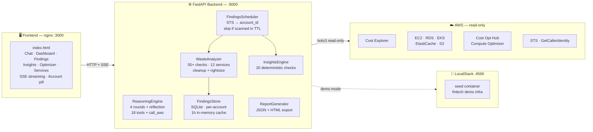

# CLAUDE.md — FinOps Intelligence Platform

## What This Is

Demo project by **DevOps ARG** (www.devopsarg.com) — an AI-powered FinOps platform that analyzes AWS cloud costs and infrastructure using conversational AI. This is a showcase of DevOps ARG's capabilities in platform engineering, agentic AI, and cloud cost optimization.

**This is NOT a toy.** It demonstrates production-grade patterns: multi-round agentic reasoning, tool orchestration, SSE streaming, LocalStack for zero-cost demos, and a real FastAPI backend with proper session management.

## Architecture



## Project Structure

```
finops-agent/
├── backend/
│   ├── config/manager.py          — Env-based config loading + validation
│   ├── llm/
│   │   ├── provider.py            — Abstract LLM interface
│   │   ├── anthropic_provider.py  — Claude integration (tool_use support)
│   │   └── openai_provider.py     — GPT integration (function_calling)
│   ├── models/
│   │   ├── core.py                — Session, Message, ToolResult
│   │   ├── finding.py             — Finding dataclass (waste scan result, account_id per finding)
│   │   └── insight.py             — Insight dataclass (billing check result)
│   ├── tools/
│   │   ├── base.py                — BaseTool interface (get_definitions + execute)
│   │   ├── registry.py            — Tool registry: register providers, dispatch by name
│   │   ├── aws_costs.py           — 8 Cost Explorer tools (query, forecast, anomalies, rightsizing...)
│   │   ├── aws_resources.py       — 7 infra tools (EC2, RDS, EKS, ElastiCache, S3, optimization)
│   │   ├── aws_api.py             — call_aws: generic read-only boto3 dispatcher (any AWS API)
│   │   ├── waste_analyzers.py     — 55+ waste checks across 12 services; NAT idle→cleanup/critical
│   │   ├── findings_store.py      — SQLite store: per-account scan runs, 1h in-memory cache
│   │   ├── findings_scheduler.py  — Startup scan: resolves AWS account via STS, skips if scan exists for that account
│   │   ├── insights_engine.py     — 20 deterministic billing checks (no LLM)
│   │   ├── insights_store.py      — Insights persistence + cache
│   │   ├── insights_scheduler.py  — Insights TTL scheduler
│   │   ├── live_resources.py      — multi-region live AWS queries
│   │   ├── mock_data.py           — "Ribbon" fictional fintech data (account 666666666666)
│   │   ├── knowledge.py           — search_knowledge_base tool
│   │   └── registry.py            — tool registry
│   ├── knowledge/store.py         — In-memory KB with JSON file persistence
│   ├── reasoning/engine.py        — Multi-round reasoning loop (up to 4 rounds + reflection)
│   ├── reports/
│   │   ├── generator.py           — Weekly cost report builder (JSON)
│   │   └── html_report.py         — Self-contained HTML export (all sections)
│   └── server/main.py             — FastAPI app; all endpoints; account_id in health + findings responses
├── frontend/index.html            — Single-page UI: chat, dashboard, findings, insights
│                                    Account pill in topbar (🔒 real / ⚠ mock)
│                                    Waste tab shows account + scan timestamp in meta line
│                                    Service cards: "Ask AI →" with service-specific context prompt
├── scripts/
│   ├── setup.py                   — Initial setup: generate report + populate knowledge base
│   ├── seed_localstack.py         — Seeds LocalStack with demo AWS resources (fintech startup)
│   └── test_connection.py         — AWS + LLM connectivity test
├── create-read-only.sh            — IAM read-only user provisioning + write-block verification
├── docker-compose.yml             — 4 services: localstack, seed, finops-agent, frontend
├── nginx.conf                     — Reverse proxy: /api/ → backend:8000, SSE passthrough
├── requirements.txt               — fastapi, uvicorn, boto3, anthropic, openai, pydantic
├── Dockerfile                     — Python 3.11 slim
├── .env.example                   — All config vars documented
└── report_data.json               — Cached weekly cost report (generated by setup.py or seed)
```

## How to Run

### Demo mode (no AWS account needed)

```bash
cp .env.example .env
# Edit .env: set ANTHROPIC_API_KEY (or OPENAI_API_KEY)
# USE_LOCALSTACK=true is already the default
docker compose up --build
# Open http://localhost:3000
```

Mock mode uses account sentinel `666666666666` — clearly marked in the UI so demo data
is never confused with real AWS data.

### Real AWS mode

```bash
# Step 1: provision read-only IAM user
./create-read-only.sh <your-admin-profile>

# Step 2: start the stack
docker compose up --build
# Open http://localhost:3000
```

On startup the backend calls STS, logs the ARN, and verifies write-access is blocked.
The UI shows the real account ID (`🔒 123456789012`) in the topbar.

## Key Endpoints

| Method | Path | Description |
|--------|------|-------------|
| GET | `/api/health` | Health check + provider/model/tool info + `account_id` of latest scan |
| POST | `/api/chat/stream` | SSE streaming chat (main endpoint) |
| POST | `/api/chat` | REST chat (full response, no streaming) |
| GET | `/api/report` | Weekly cost report (cached) |
| POST | `/api/report/refresh` | Regenerate cost report from live data |
| GET | `/api/report/export` | Download self-contained HTML report |
| GET | `/api/infrastructure` | Live infra health (EC2, RDS, EKS, etc.) |
| GET | `/api/optimize` | Cost optimization recommendations |
| GET | `/api/findings` | Waste findings from latest scan (filters: service, severity, category, min_savings, region, account_id) |
| POST | `/api/findings/refresh` | Trigger a new waste scan immediately |
| GET | `/api/findings/trends` | Historical scan results for trend analysis |
| GET | `/api/insights` | Pre-computed billing insights (no LLM) |
| POST | `/api/insights/refresh` | Re-run all insight checks |
| GET | `/api/cost-by-tags` | Cost breakdown by tag keys |
| POST | `/api/config/mock` | Toggle USE_MOCK_DATA at runtime |

## Reasoning Engine

The core differentiator. `backend/reasoning/engine.py`:

1. User query arrives
2. LLM gets SYSTEM_PROMPT + conversation history + 18 tool definitions (including `call_aws`)
3. **Round 1**: LLM calls tools (e.g., `get_current_date` → `query_aws_costs`)
4. **Reflection**: Engine injects reflection prompt — "do you have enough data?"
5. **Rounds 2-4**: Additional tool calls if needed (comparison periods, different breakdowns)
6. **Final synthesis**: Structured markdown answer with real numbers
7. If LLM "plans" instead of acting in round 1, engine pushes back: "execute, don't describe"

SSE events: `thinking`, `tool_call`, `tool_result`, `answer`, `done`, `error`

## Waste Detection Engine

`backend/tools/waste_analyzers.py` — 55+ checks across 12 AWS services.

Two categories:
- **cleanup** — resources to delete (orphans, zombies, idle). Severity: `critical` or `warning`.
- **rightsize** — resources over-provisioned for their usage. Severity: `warning` or `info`.

NAT Gateway logic:
- 0 bytes in 7 days → `cleanup / critical` — full cost savings (safe to delete)
- < 1 GB/day → `rightsize / warning` — VPC endpoint opportunity

### Per-Account Scan Isolation

`FindingsStore` stores `account_id` on every `scan_run` record:
- Live mode: real account from `STS GetCallerIdentity`
- Mock mode: sentinel `666666666666`

On container restart `FindingsScheduler`:
1. Resolves current account
2. Queries SQLite for a completed scan for **that account** within `WASTE_SCAN_TTL_HOURS` (default 72h)
3. If found → skips startup scan (data is fresh)
4. If not found → runs initial scan automatically

`append_batch()` overrides every finding's `account_id` with the scan's account — mock and live
data are never mixed in the DB even if you switch modes.

## Service "Ask AI" Buttons

Each service card in the Services tab has an "Ask AI →" button (`askAboutService()` in `index.html`).

It builds a context-rich prompt including:
- Real cost numbers from `_serviceMap` (weekly breakdown, trend direction, monthly projection)
- Up to 5 pre-detected waste scanner findings for that service from `state.findings.findings`
- A service-specific deep-dive question from `SVC_DEEP_QUESTIONS` (14 service types covered: EC2, RDS, S3, Lambda, ElastiCache, EKS, Data Transfer, CloudWatch, DynamoDB, OpenSearch, ELB, VPC, Secrets Manager, ECR)

Then switches to the chat tab and auto-sends the prompt.

## Config

All via `.env` — see `.env.example` for full list. Key vars:

- `AI_PROVIDER`: `anthropic` or `openai`
- `ANTHROPIC_API_KEY` / `OPENAI_API_KEY`: LLM credentials
- `USE_LOCALSTACK`: `true` for demo, `false` for real AWS
- `USE_MOCK_DATA`: override to return mock data even in live mode
- `AWS_DEFAULT_REGION`: default region for single-region scans
- `AWS_REGIONS_TO_ANALYZE`: comma-separated regions for waste scans
- `WASTE_SCAN_TTL_HOURS`: default `72` — hours before scan is stale per account
- `COST_TAG_KEYS`: tag keys for billing breakdown (e.g. `env,project,team`)
- `PORT`: Backend port (default 8000)

## Code Conventions

- Python 3.11, FastAPI + Pydantic
- Abstract LLM provider interface — swap Claude/GPT without touching business logic
- Tool system: implement `BaseTool`, register with `ToolRegistry`, engine discovers automatically
- No ORM — direct boto3 calls to Cost Explorer / describe-* APIs
- Frontend: single `index.html`, vanilla JS, no framework, SSE via EventSource
- Mock sentinel account: `666666666666` — never a real AWS account number
