# FinOps Intelligence Platform

**Built by [DevOps ARG](https://www.devopsarg.com) · powered with Claude**

<p align="center">
  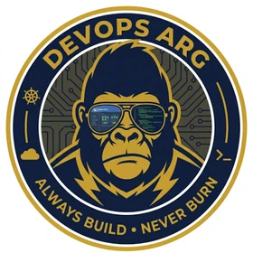
</p>

An AI-powered FinOps agent that analyzes AWS cloud costs and infrastructure using
conversational AI. Ask questions in natural language — the agent reasons across
Cost Explorer, infrastructure metrics, and AWS's native recommendation APIs (Cost
Optimization Hub, Compute Optimizer, Rightsizing, Savings Plans) to answer them.

Beyond chat: an automated **waste detection engine** (55+ checks across 12 AWS
services) runs scheduled scans and persists findings to SQLite; a **billing
insights engine** (20 pre-computed checks) surfaces high-signal cost patterns
without LLM invocations; and a **self-contained HTML export** lets you share
full cost + infrastructure reports with stakeholders.

> **Read-only by design.** The agent uses a dedicated IAM user with the AWS-managed
> `ReadOnlyAccess` policy. It can't create, modify, or delete anything in your
> account — it reads metrics and suggests changes that you apply yourself.

---

## 🖼 Screenshots

### 1. Conversational chat with live reasoning trace
The main entry point. Users ask questions in plain English; the right-hand panel streams the reasoning — every tool call, every intermediate result, and the final synthesis. The sidebar on the left holds the 27 preset questions grouped by category.

<p align="center">
  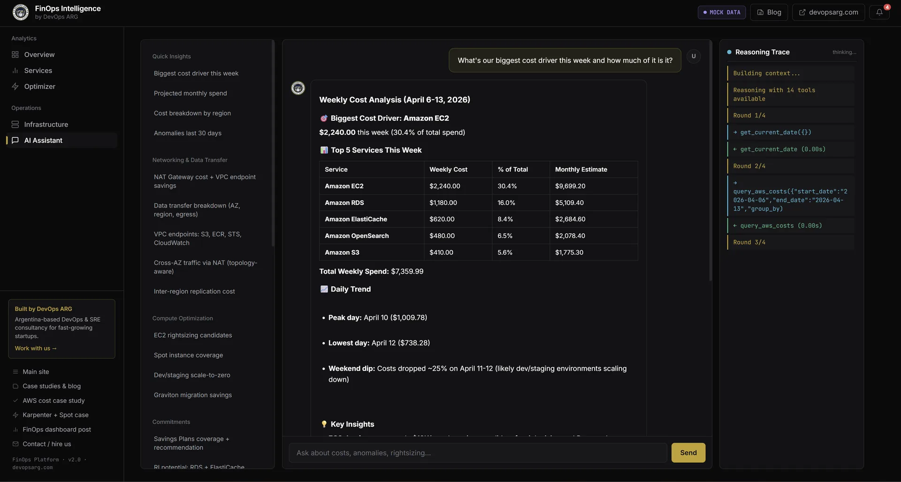
</p>

### 2. Deep-dive chat example — NAT Gateway traffic analysis
A layered question ("how much traffic is flowing between AZs through NAT Gateway instead of staying within AZ?") produces a multi-round response: the agent queries Cost Explorer by usage type, correlates with the traffic pattern data, quantifies the optimization opportunity ($2,893/month), and recommends the concrete fix (AWS PrivateLink endpoints).

<p align="center">
  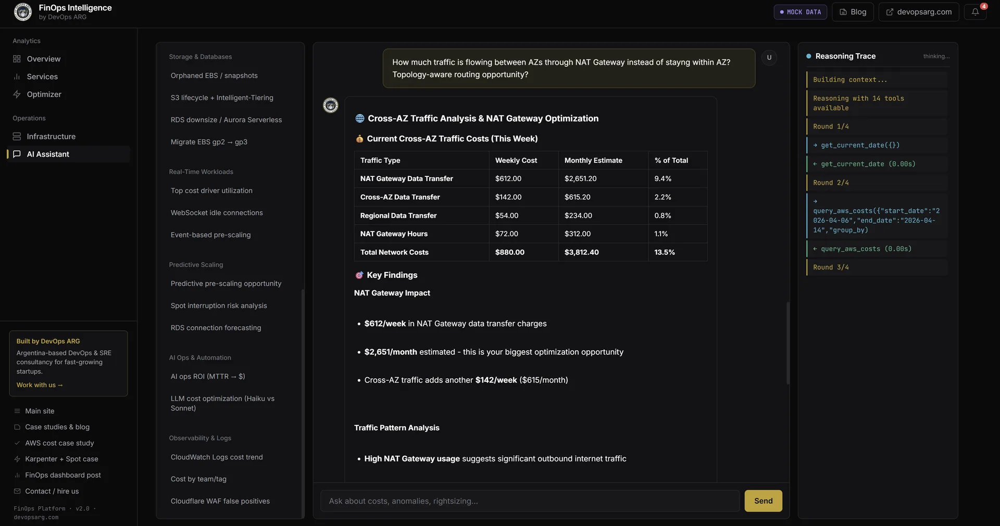
</p>

### 3. Cost Overview dashboard
Landing page of the dashboard tab — last-7-days spend, monthly projection, savings-identified counter, active-services count, a 4-week trend line, service-breakdown donut, and the latest cost anomalies detected by the AWS Cost Anomaly Detection integration.

<p align="center">
  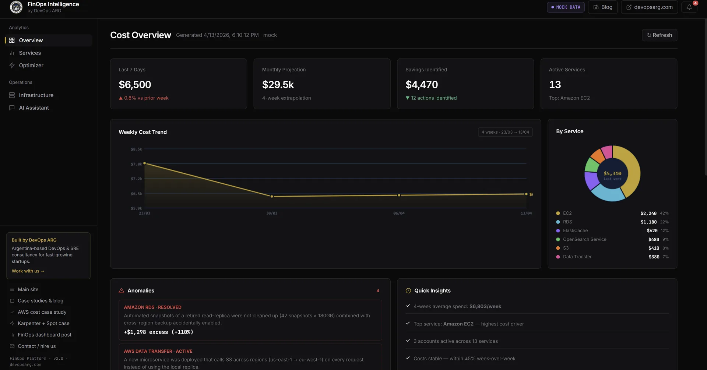
</p>

### 4. Services breakdown
Per-service grid view — every active AWS service with last-week / this-week / monthly projection, and a mini sparkline for the 4-week trend. Each card has an **"Ask AI →"** button that opens the chat tab with a pre-filled, service-specific deep-dive prompt: it injects real cost numbers, week-over-week trend direction, and any pre-detected waste scanner findings for that service into the question, so the agent starts with full context instead of having to re-fetch it.

<p align="center">
  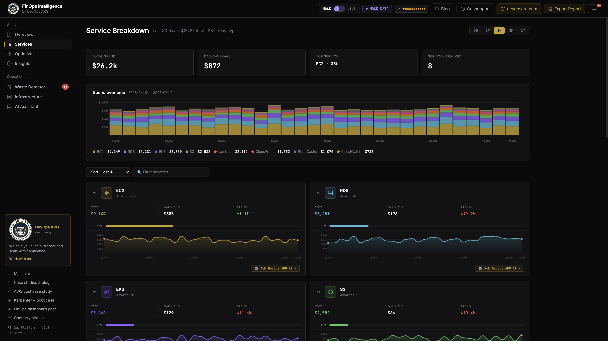
</p>

### 5. Live infrastructure health
EC2 / RDS / EKS / ElastiCache / OpenSearch / S3 cards, each showing monthly $ + health indicator (OK / warning / critical). Single-region by default; `region=all` fans out to every enabled region in parallel (~20s round-trip on an 18-region account). Warnings surface the exact issue — "Primary at 80% CPU, downsize candidate", "2 clusters missing system metrics on 2% data upload".

<p align="center">
  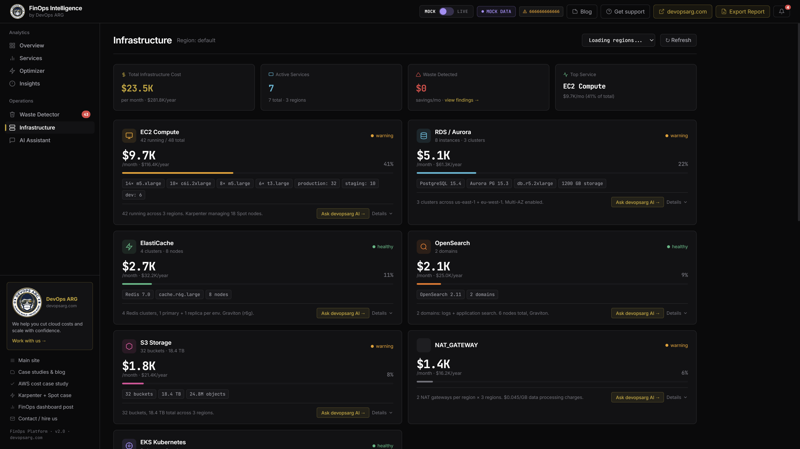
</p>

### 6. Optimization recommendations
Cost Optimization Hub results ranked by monthly savings. Each card explains WHAT to change, the estimated monthly $ savings, a difficulty tag (easy / medium / hard), and an "Ask AI →" button that opens the chat with the recommendation as context — so you can ask *"why this specific instance class?"* or *"what's the risk of this migration?"* before executing.

<p align="center">
  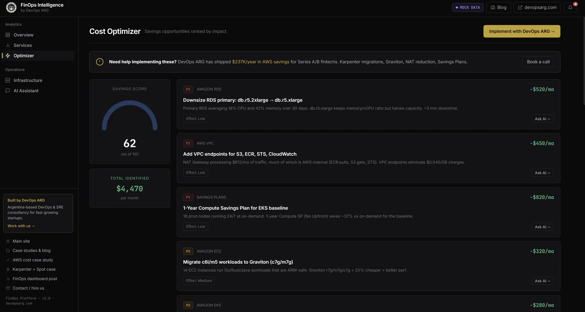
</p>

---

## 📖 Table of contents

- [What it answers](#what-it-answers) — the 27 preset questions and what tools they trigger
- [Architecture](#architecture) — services, data flow, diagram
- [Quick start](#quick-start) — mock mode + live AWS mode
- [Feature flags](#feature-flags-env) — all `.env` variables
- [Endpoints](#endpoints) — HTTP API reference
- [The reasoning engine](#the-reasoning-engine) — multi-round loop, reflection, SSE events
- [Waste detection engine](#waste-detection-engine) — 55+ checks, SQLite persistence, scheduled scans
- [Billing insights engine](#billing-insights-engine) — 20 pre-computed checks, no LLM required
- [The read-only setup script](#the-read-only-setup-script) — IAM provisioning + write-block verification
- [Project structure](#project-structure)
- [Security posture](#security-posture)
- [Want help running it in production?](#want-help-running-it-in-production)

## What it answers

The sidebar ships with **27 high-value FinOps questions across 9 categories**, all drawn from real DevOps ARG case studies. Pick one with a click, or ask your own in free-form text.

| Category | Example question | What it does under the hood |
|----------|-------------------|-----------------------------|
| ⚡ **Quick insights** | *"What's driving my AWS bill this month?"* | `get_current_date` → `query_aws_costs` grouped by service → ranks top 10 by $ |
| 🌐 **Networking & data transfer** | *"How much am I spending on NAT Gateway?"* | Cost Explorer filter on `AWS Data Transfer` + NAT usage type → summarizes by AZ |
| 🖥 **Compute optimization** | *"Which EC2 instances are oversized?"* | Queries `get_rightsizing_recommendations` + `get_compute_optimizer_recommendations` → annotates with monthly savings |
| 💸 **Commitments** | *"What's my Savings Plans coverage?"* | `get_savings_plans_coverage` → compares covered vs on-demand, flags gaps |
| 💾 **Storage & databases** | *"Do I have orphaned EBS volumes?"* | `list_ebs_volumes` → filters unattached/available → sums monthly $ at gp2/gp3 rates |
| 📊 **Observability** | *"How is my CloudWatch Logs cost trending?"* | Cost Explorer filter on `AWS CloudWatch` service + Logs usage type, 4-week series |
| 🔄 **Real-time workloads** | *"How many WebSocket connections am I running?"* | `describe_load_balancers` + CloudWatch active connections metric |
| 📈 **Predictive scaling** | *"What's my safe baseline with Spot?"* | `get_spot_instance_price_history` + EC2 inventory → spot interruption risk per family |
| 🤖 **AI Ops** | *"What's the ROI of reducing MTTR?"* | Knowledge-base lookup for past incident ARR impact + recent cost burst patterns |

Every preset question in the sidebar has a hover tooltip explaining which tools it triggers — a nice teaching moment for anyone new to FinOps.

The **Services tab** adds a second entry point: each service card has an **"Ask AI →"** button that fires a service-specific prompt pre-loaded with real cost data (weekly breakdown, month-over-month trend, monthly projection) and any waste scanner findings detected for that service. The prompt varies by service type — EC2 asks about instance families and purchase types, RDS about connection counts and Multi-AZ, S3 about lifecycle rules and multipart uploads, NAT Gateway about cross-AZ traffic, etc.

## Architecture

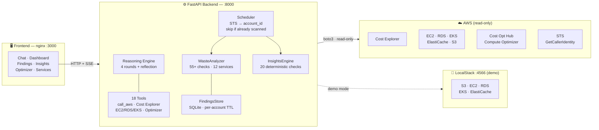

**Data flow — chat:** user message → Reasoning Engine selects tools → boto3 calls AWS → LLM synthesizes answer → streamed back over SSE with full reasoning trace.

**Data flow — findings/insights:** Scheduler resolves AWS account via STS → checks SQLite for existing scan for that account (respects `WASTE_SCAN_TTL_HOURS`) → if none found, runs 55+ analyzers → tags every finding with `account_id` → writes to SQLite → `/api/findings` serves cached results instantly. Mock mode uses sentinel `666666666666` so demo data never pollutes a real account's history.

## Quick start

### 1. Mock mode (no AWS account needed)

Great for demos, screencasts, and playing with the UI.

```bash
cp .env.example .env
# Edit .env: ANTHROPIC_API_KEY=sk-ant-...
# Set USE_MOCK_DATA=true
docker compose up --build
# Open http://localhost:3000
```

The mock data is a **fictional Series B LatAm fintech called "Ribbon"** with
~$28K/mo AWS spend across 3 regions. All dates are relative to today, so the
demo never looks stale.

### 2. Live AWS mode (read-only)

For running against your real AWS account with safety guarantees.

```bash
# Step 1: create a dedicated read-only IAM user
./create-read-only.sh <your-admin-profile>

# This creates an IAM user named `finops-agent-readonly` with ReadOnlyAccess,
# generates keys, writes them to .env + ~/.aws/credentials as profile "finops",
# and verifies write attempts are blocked (tries s3 mb, expects 403).

# Step 2: start the stack
docker compose up --build
# Open http://localhost:3000
```

On startup the backend prints an identity check so you know which ARN is
being used:

```
============================================================
AWS IDENTITY CHECK
  Account: <your-aws-account-id>
  ARN:     arn:aws:iam::<your-aws-account-id>:user/finops-agent-readonly
  UserId:  <IAM-user-unique-id>
============================================================
```

If the ARN doesn't contain "readonly" you'll get a WARNING in the logs — the
identity check **fails the startup** if it can't validate live-mode credentials.

## Feature flags (`.env`)

| Variable | Default | What it does |
|----------|---------|--------------|
| `AI_PROVIDER` | `anthropic` | `anthropic` or `openai` |
| `ANTHROPIC_API_KEY` | — | Required for anthropic |
| `ANTHROPIC_MODEL` | `claude-sonnet-4-20250514` | Model for reasoning |
| `USE_LOCALSTACK` | `false` | Force LocalStack demo (no real AWS) |
| `USE_MOCK_DATA` | `false` in live, `true` in localstack | Override: return mock data from `/api/report`, `/api/infrastructure`, `/api/optimize` even in live mode |
| `AWS_DEFAULT_REGION` | `us-east-1` | Default region for single-region infra scans |
| `AWS_REGIONS_TO_ANALYZE` | `AWS_DEFAULT_REGION` | Comma-separated regions for waste detection scans (e.g. `us-east-1,us-east-2,eu-west-1`) |
| `AWS_ACCESS_KEY_ID` / `AWS_SECRET_ACCESS_KEY` | — | Read-only keys from `create-read-only.sh` |
| `WASTE_SCAN_TTL_HOURS` | `72` | Hours before a new waste scan is considered stale. On container restart, the scheduler checks if the **current AWS account** already has a completed scan within this window; if yes it skips the scan automatically. Set to `0` to always re-scan on startup. |
| `COST_TAG_KEYS` | `env` | Tag keys for Billing Insights cost breakdown (e.g. `env,project,team`) |

When `USE_MOCK_DATA=true` the backend returns the fictional "Ribbon" data. The
dashboard header shows a yellow **MOCK DATA** badge and a `⚠ 666666666666` account
pill so users can't mistake it for real numbers. In live mode the pill shows
`🔒 <real-account-id>` in green — visible in both the topbar and the Waste tab.

## Endpoints

| Method | Path | Description |
|--------|------|-------------|
| `GET`  | `/api/health` | Status, mode, `account_id` of the latest scan, findings count, and scanning flag |
| `POST` | `/api/chat/stream` | SSE chat with live reasoning trace |
| `POST` | `/api/chat` | Non-streaming chat (returns full response) |
| `GET`  | `/api/report` | Weekly cost report (by service/account/region/env/team) |
| `POST` | `/api/report/refresh` | Regenerate from live data |
| `GET`  | `/api/report/trend` | 4-week cost trend series for sparklines |
| `GET`  | `/api/report/export` | Download self-contained HTML cost report |
| `GET`  | `/api/infrastructure?region=<name>` | EC2/RDS/EKS/... health. `region=all` scans every enabled region in parallel (~20s). Omitted → uses `AWS_DEFAULT_REGION`. |
| `GET`  | `/api/optimize` | Recommendations from AWS Cost Optimization Hub |
| `GET`  | `/api/findings` | Waste findings from the latest scan for the current account. Filters: `service`, `severity`, `category`, `min_savings`, `region`, `account_id` |
| `POST` | `/api/findings/refresh` | Trigger a new waste scan immediately |
| `GET`  | `/api/findings/trends` | Historical scan results for trend tracking |
| `GET`  | `/api/insights` | Pre-computed billing insights (no LLM required) |
| `POST` | `/api/insights/refresh` | Re-run all insight checks |
| `GET`  | `/api/cost-by-tags` | Cost breakdown by tag keys defined in `COST_TAG_KEYS` |
| `POST` | `/api/config/mock` | Toggle `USE_MOCK_DATA` at runtime without restart |

## The reasoning engine

`backend/reasoning/engine.py` runs a **multi-round agentic loop** — not a single prompt with a canned answer. This is what lets the agent adapt when the first query doesn't return enough data, or when a user asks a layered question (e.g. "compare this month vs last month and tell me what changed").

### Flow

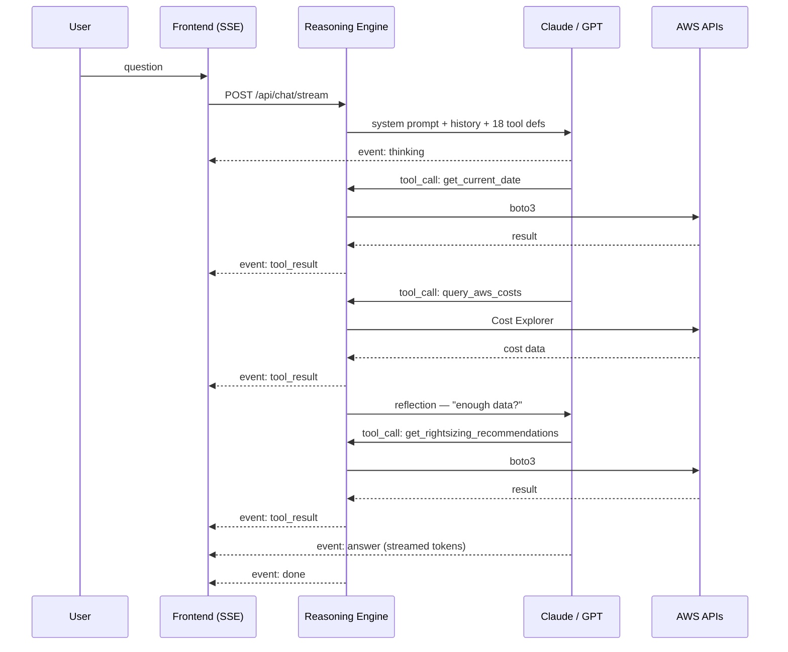

1. **User query arrives** over `/api/chat/stream`.
2. LLM (Claude Sonnet 4 by default) sees `SYSTEM_PROMPT` + full conversation history + 18 tool definitions.
3. **Round 1** — LLM calls tools. Typical trajectory: `get_current_date` → `query_aws_costs` → maybe `get_cost_forecast`. `call_aws` lets the LLM issue any read-only boto3 command dynamically.
4. **Reflection step** — engine injects *"do you have enough data? If not, what would you call next?"*.
5. **Rounds 2-4** — up to 3 additional tool-call rounds. Hard cap at 4 to control cost.
6. **Final synthesis** — structured markdown with real numbers. If a tool returned no data the agent states that explicitly rather than hallucinating.

<p align="center">
  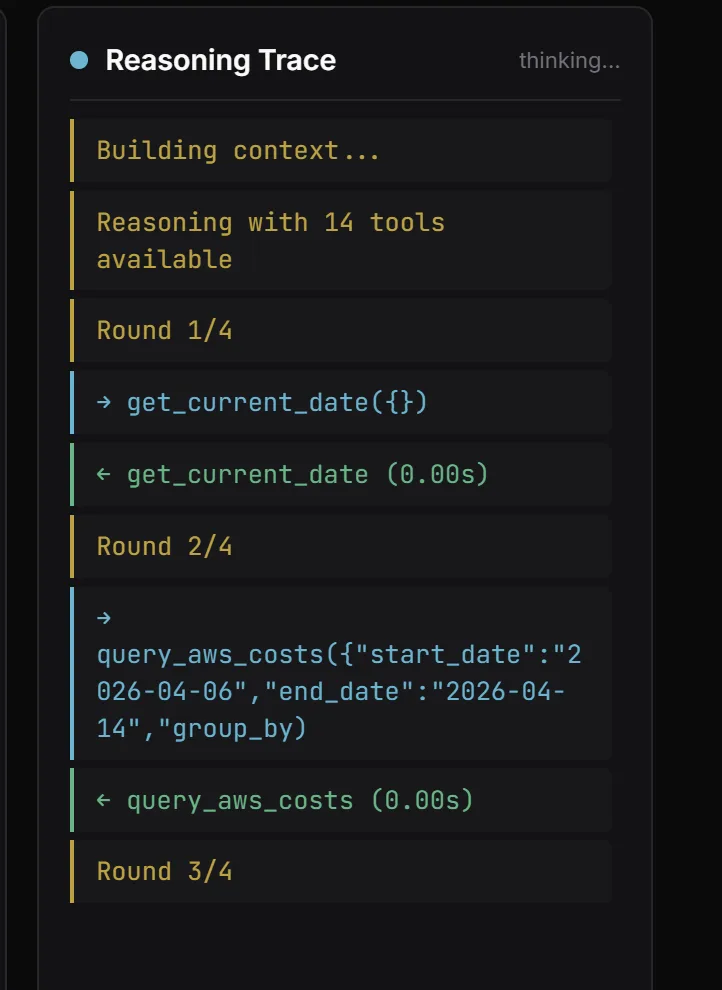
</p>

### SSE event types (live streaming)

| Event | When fired | Payload |
|-------|------------|---------|
| `thinking` | LLM generates a `<thinking>` block | `{text}` |
| `tool_call` | LLM decides to call a tool | `{name, args}` |
| `tool_result` | Backend returns tool output | `{name, result}` |
| `answer` | LLM produces final markdown | `{text}` (streamed token-by-token) |
| `done` | Conversation turn ends | `{rounds, total_tokens}` |
| `error` | Any failure | `{message, retriable}` |

The frontend renders these in the **Reasoning Trace** panel on the right of the chat tab, colored by type, in real time. No spinner theater — if the agent is on round 3 of 4, the user sees exactly which tool is running.

### Why this matters

Most "chat with your data" demos use a single tool call and hope for the best. FinOps questions often need cross-referencing: *cost by service* then *instances in that service* then *rightsizing recs for those instances*. A multi-round loop with reflection lets the agent plan, execute, check, and re-plan — which is why the answers cite specific instance IDs and real dollar figures instead of vague strategies.

### How multi-region scan works

- **Cost Explorer (`/api/report`)** — calls `GetCostAndUsage` in `us-east-1`
  without a region filter, so you get **all-region totals** by default.
  Optionally groups by `REGION` for per-region breakdown.
- **Infrastructure (`/api/infrastructure`)** — by default scans the region set
  in `AWS_DEFAULT_REGION`. Pass `?region=all` to parallel-scan every enabled
  region (18+ on typical accounts). The UI exposes a dropdown to switch.

## Waste detection engine

`backend/tools/waste_analyzers.py` implements **55+ resource checks** inspired by
open-source cloud custodian tools. Checks are split into two categories:

- **cleanup** — zombie/orphan resources that should be deleted (old snapshots,
  unattached EBS volumes, idle load balancers, unused EIPs, empty ECR repos…)
- **rightsize** — resources over-provisioned for their actual usage (EC2 instances,
  RDS instances with <5% CPU, ElastiCache nodes, Lambda with excess memory…)

Coverage by service:

| Service | Example checks |
|---------|----------------|
| EC2 | Stopped >7 days, oversized (CloudWatch CPU p95 <10%), unassociated EIPs |
| EBS | Unattached volumes, orphaned snapshots (source volume deleted), gp2 candidates |
| RDS | Multi-AZ on non-prod, idle (<1 connection/day), old manual snapshots |
| ELB / ALBv2 | Zero request count >14 days, no healthy targets |
| NAT Gateway | **Idle** (0 bytes for 7+ days → `cleanup/critical`, full cost savings); **Low traffic** (<1 GB/day → `rightsize/warning`, VPC endpoint opportunity) |
| ElastiCache | Low cache-hit-ratio, undersized/oversized nodes |
| Lambda | Zero invocations >30 days, oversized memory (p95 used <20% of configured) |
| DynamoDB | Tables with 0 reads/writes, provisioned mode with low utilization |
| S3 | Buckets with no lifecycle rules and large size, incomplete multipart uploads |
| CloudWatch Logs | Log groups with no retention policy set, high ingest cost |
| ECR | Repositories with no pulls >90 days, untagged image accumulation |
| Misc | Secrets Manager secrets unused >90 days, old ACM certs |

### How it works

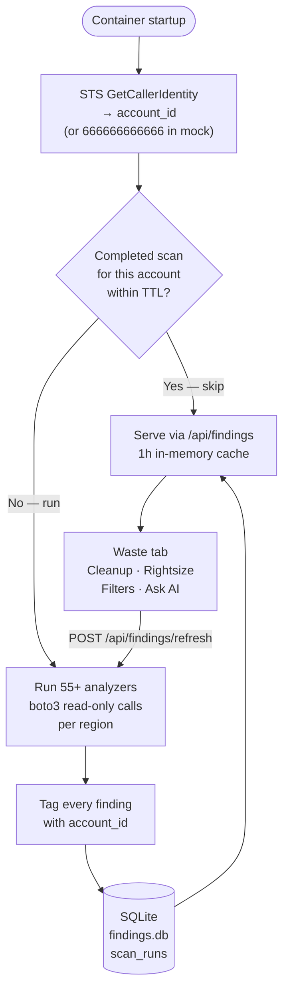

1. Resolves AWS account via `STS GetCallerIdentity` (live) or uses sentinel `666666666666` (mock).
2. Checks SQLite for a completed scan **for that account** within `WASTE_SCAN_TTL_HOURS` (default 72h). If found → skips. If not → runs automatically.
3. Every finding is tagged with `account_id` — mock and live data never mix in the same DB.
4. `scan_runs` stores `account_id`, timestamps, and aggregated savings for correct TTL checks across restarts.
5. `/api/findings` returns findings from the latest scan, with optional filters (`service`, `severity`, `category`, `region`, `account_id`); 1h in-memory cache on top.
6. Users trigger a manual rescan via the **Refresh Scan** button in the UI or `POST /api/findings/refresh`.

Set `WASTE_SCAN_TTL_HOURS=0` to re-scan on every container restart (useful in CI/CD pipelines).

## Billing insights engine

`backend/tools/insights_engine.py` runs **20 deterministic billing checks** against
live AWS APIs — no LLM invocation, no latency, no per-token cost. Results are
returned in milliseconds from the in-memory cache.

| Category | Checks |
|----------|--------|
| **cost** | Month-over-month anomaly, top service by spend, service concentration risk |
| **networking** | NAT Gateway cross-AZ ratio, missing VPC endpoints, data transfer patterns |
| **commitments** | Savings Plans coverage gap, RI utilization, on-demand vs committed ratio |
| **compute** | Graviton migration candidates, Spot interruption-safe workloads, gp2→gp3 |
| **storage** | S3 without intelligent-tiering, CloudWatch Logs without retention, EBS snapshot cost |
| **database** | RDS Multi-AZ in non-prod, idle RDS instances, RDS snapshot accumulation |
| **lambda** | Functions with deprecated runtimes, oversized memory allocations |

Insights are refreshed by the `InsightsScheduler` on the same TTL cycle as findings.
The `/api/insights` endpoint returns all checks with a severity level (`info`, `warning`,
`critical`), estimated monthly savings, and a one-line recommendation.


`create-read-only.sh` is the **safety moat**. You run it once with an admin AWS profile; it provisions everything the agent needs and proves the agent can't write:

1. **Creates IAM user** `finops-agent-readonly` using your admin profile
2. **Attaches** the AWS-managed `ReadOnlyAccess` policy (covers `ce:*`, `ec2:Describe*`, `rds:Describe*`, all the `*List*` / `*Get*` — plus `coh:*` for Cost Optimization Hub)
3. **Generates access keys** and writes them to:
   - `.env` (for the backend container — `AWS_ACCESS_KEY_ID`, `AWS_SECRET_ACCESS_KEY`)
   - `~/.aws/credentials` as profile `finops` (for your shell / debugging)
4. **Verifies read works** — runs `aws sts get-caller-identity` using the new keys
5. **Verifies writes are BLOCKED** — runs `aws s3 mb s3://devopsarg-finops-verify-readonly` with the new keys; expects HTTP 403 Forbidden. If the bucket gets created, the script **aborts with a security warning** and rolls back.
6. **Prints the ARN** for audit (redacted in public output — see `AWS IDENTITY CHECK` block below)

Re-running the script **rotates the access keys** — deletes old, creates new, rewrites `.env` and `~/.aws/credentials`. Safe to run on a schedule.

<!-- readonly-setup screenshot pending — show your ./create-read-only.sh terminal output with the 403 verification step after redacting account IDs -->

### Recommended rotation cadence

- Dev machines: every 30 days
- Shared demo boxes: every 7 days
- CI runners: per-run (the script takes ~15 seconds end to end)

## Project structure

```
finops-agent/
├── backend/
│   ├── config/manager.py          — env-based config + feature flags
│   ├── llm/                       — Anthropic / OpenAI providers
│   ├── models/
│   │   ├── core.py                — Session, Message, ToolResult
│   │   ├── finding.py             — Finding Pydantic model (waste scan results)
│   │   └── insight.py             — Insight Pydantic model (billing checks)
│   ├── tools/
│   │   ├── aws_costs.py           — 8 Cost Explorer tools
│   │   ├── aws_resources.py       — 7 infra inspection tools
│   │   ├── aws_api.py             — call_aws: generic read-only boto3 dispatcher
│   │   ├── waste_analyzers.py     — 55+ waste checks across 12 services
│   │   ├── findings_store.py      — SQLite persistence + 1h in-memory cache
│   │   ├── findings_scheduler.py  — TTL-based background scan orchestrator
│   │   ├── insights_engine.py     — 20 deterministic billing checks
│   │   ├── insights_store.py      — Insights persistence + cache
│   │   ├── insights_scheduler.py  — Insights refresh scheduler
│   │   ├── live_resources.py      — multi-region live AWS queries
│   │   ├── mock_data.py           — "Ribbon" fictional fintech data
│   │   ├── knowledge.py           — KB search tool
│   │   └── registry.py            — tool registry
│   ├── reasoning/engine.py        — 4-round loop with reflection
│   ├── reports/
│   │   ├── generator.py           — cost report builder (JSON)
│   │   └── html_report.py         — self-contained HTML export
│   └── server/main.py             — FastAPI app, SSE streaming, all endpoints
├── frontend/
│   └── index.html                 — single-page UI: chat + dashboard + findings + insights
├── scripts/
│   ├── seed_localstack.py         — LocalStack AWS resource seed
│   ├── setup.py                   — knowledge base setup
│   └── test_connection.py         — AWS + LLM connectivity test
├── create-read-only.sh            — IAM read-only user provisioning + write-block verify
├── docker-compose.yml             — 3 services + finops-data volume for SQLite
├── nginx.conf                     — reverse proxy with SSE-safe buffering
└── .env.example                   — all config documented
```

## Security posture

- **Read-only IAM** by construction (managed policy, not custom).
- **No write paths** in any tool — grep the `backend/tools/` directory for
  `create_*`, `delete_*`, `put_*`, `modify_*` etc. — there aren't any.
- **Identity check on startup** logs the ARN and fails-fast if invalid.
- **Cost Optimization Hub** recommendations are read-only queries; implementation
  is always human-in-the-loop (the agent suggests, you execute).

## Want help running it in production?

DevOps ARG builds this kind of tooling for Series A/B fintechs and scale-ups.
If you want:

- A custom FinOps agent for your stack
- A managed deployment with auth + multi-tenant
- Actual execution on the recommendations (rightsizing, Savings Plans, Karpenter migrations)

**[Book a call at devopsarg.com](https://www.devopsarg.com/en/#contact)** or read our case studies:

- [$237K/year AWS savings](https://www.devopsarg.com/en/blog/aws-cost-optimization-case-study/) — concrete breakdown, real customer
- [Karpenter + Spot + scale-to-zero](https://www.devopsarg.com/en/blog/karpenter-spot-scale-to-zero/) — $392K/year
- [FinOps dashboard with Grafana + Prometheus](https://www.devopsarg.com/en/blog/finops-dashboard-grafana-prometheus/) — $8K/mo waste found day 1

## License

MIT

---

*Built in Buenos Aires · [devopsarg.com](https://www.devopsarg.com)*
